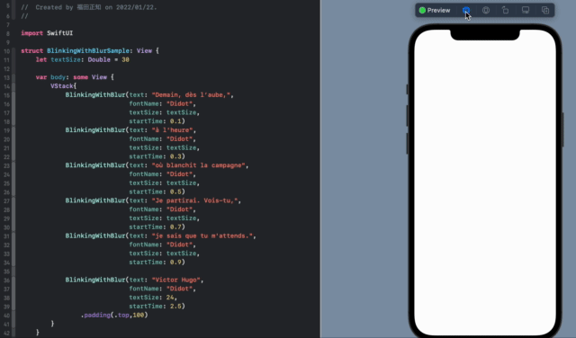
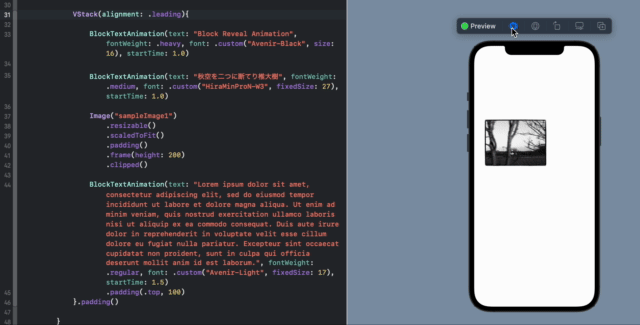
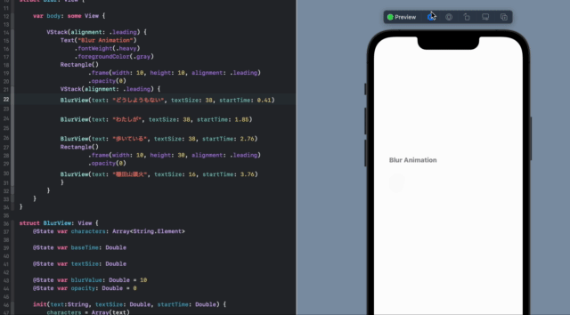
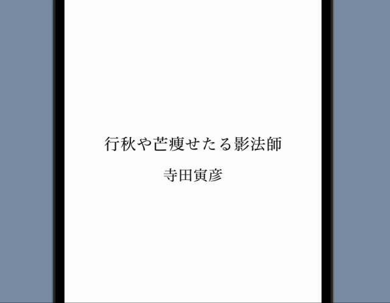

⚠️ This repository is under construction.

# SwiftUI Text Animation Library

Make your app more animated 🔥

This is a SwiftUI text animation library, using only SwiftUI's basic functions.

## BlinkingWithBlur 

## Block 

## Blur 

## DropShadow 

## Fade In and Out

## Bounce Text

